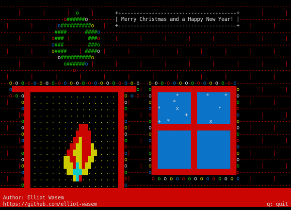

# Fireplace, the warm cozy scene for your terminal!

This is a simple program I wrote initially just before Christmas 2021. I've decided to try and write a holiday greeting card once every year before Christmas to share with the world, and here's this year's edition of it! It takes no commandline arguments, and the controls are very straightforward:

- quit: `q`

Feel free to fork and alter, but please give me credit where it is due!

